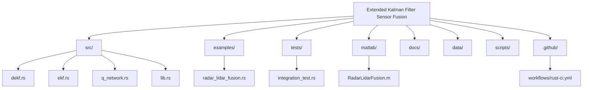

# Extended Kalman Filter Sensor Fusion

[](https://github.com/ashishrai12/Radar-and-LiDAR-Fusion-for-Object-Detection-and-Tracking/actions)
[](https://opensource.org/licenses/MIT)

A high-performance Rust library for robotic state estimation, featuring a Differentiable Extended Kalman Filter (DEKF) with neural-network-driven adaptive noise estimation. This project also includes a classical MATLAB simulation for visualization and benchmarking.

## Overview

This library implements a **Differentiable Extended Kalman Filter (DEKF)** that:

1.  **Standard EKF**: Uses `nalgebra` for efficient linear algebra operations in the prediction ($x = Fx + Bu$) and update steps.
2.  **Adaptive Q-Network**: Employs `dfdx` to create a small neural network that predicts the diagonal elements of the Process Noise matrix $Q$ from innovation residuals.
3.  **Learning**: Provides a `train_step` function that minimizes Mean Squared Error (MSE) between predicted states and high-resolution LiDAR ground truth.

## Project Structure



## Rust Library

### Architecture

```text
┌─────────────────────────────────────────────────────────┐
│                    DEKF Pipeline                        │
├─────────────────────────────────────────────────────────┤
│                                                         │
│  Innovation Residual (y = z - Hx)                       │
│           │                                             │
│           ├──────────────────────┐                      │
│           │                      │                      │
│           ▼                      ▼                      │
│  ┌──────────────────┐   ┌──────────────────┐            │
│  │   Q-Network      │   │  Standard EKF    │            │
│  │   (dfdx MLP)     │   │   (nalgebra)     │            │
│  │                  │   │                  │            │
│  │  Input: y (4D)   │   │  x = Fx + Bu     │            │
│  │  Output: Q_diag  │   │  P = FPF^T + Q   │            │
│  └──────────────────┘   └──────────────────┘            │
│           │                      │                      │
│           └──────────┬───────────┘                      │
│                      ▼                                  │
│           Adaptive State Prediction                     │
│                      │                                  │
│                      ▼                                  │
│              MSE Loss vs Ground Truth                   │
│                      │                                  │
│                      ▼                                  │
│              Backprop & Update Q-Network                │
└─────────────────────────────────────────────────────────┘
```

## Mathematical Foundation

### 1. Classical Extended Kalman Filter
The EKF handles state transitions and measurements. In the provided example, we use a Constant Velocity (CV) model:

**State Vector**:
$$x = [p_x, p_y, v_x, v_y]^T$$

**Prediction Step**:
- State Prediction: $\hat{x}_{k|k-1} = F_k \hat{x}_{k-1|k-1} + B_k u_k$
- Covariance Prediction: $P_{k|k-1} = F_k P_{k-1|k-1} F_k^T + Q_k$

**Update Step**:
- Innovation: $\tilde{y}_k = z_k - H_k \hat{x}_{k|k-1}$
- Innovation Covariance: $S_k = H_k P_{k|k-1} H_k^T + R_k$
- Kalman Gain: $K_k = P_{k|k-1} H_k^T S_k^{-1}$
- State Update: $\hat{x}_{k|k} = \hat{x}_{k|k-1} + K_k \tilde{y}_k$
- Covariance Update: $P_{k|k} = (I - K_k H_k) P_{k|k-1}$

### 2. Differentiable Noise Estimation
Instead of using a fixed Process Noise matrix $Q$, we dynamically estimate it based on the filter's innovation residuals:

$$Q_k = \text{diag}(\text{NN}_{\theta}(\tilde{y}_k))$$

Where $\text{NN}_{\theta}$ is a Multi-Layer Perceptron (MLP). Because the EKF equations are implemented using differentiable tensors, we can optimize the network weights $\theta$ end-to-end to minimize the trajectory error:

$$\mathcal{L} = \frac{1}{N} \sum_{i=1}^N ||\hat{x}_{k|k} - x_{GT}||^2$$

### Quick Start

```rust
use ekf_sensor_fusion::DifferentiableEKF;
use nalgebra::{DMatrix, DVector};

// Create DEKF for 4D state (x, y, vx, vy), 2D measurement, 1D control
let mut dekf = DifferentiableEKF::new(4, 2, 1);

// ... set up matrices and run prediction/update ...
```

To run the provided radar-lidar fusion example:
```bash
cargo run --example radar_lidar_fusion
```

### Docker Integration

For consistent build and execution environments, you can use the provided Dockerfile.

1. **Build the Image**:
   ```bash
   docker build -t ekf-sensor-fusion .
   ```

2. **Run the Fusion Example**:
   ```bash
   docker run ekf-sensor-fusion
   ```

## MATLAB Simulation

Located in `/matlab`, this script provides a high-fidelity visualization of the fusion process.

- **Real-time Tracking**: Visualizes ground truth vs. sensor detections vs. fused path.
- **Error Analysis**: Quantifies performance with RMSE plots.

[View MATLAB Documentation](./matlab/README.md)

## Performance Visualization

### Real-time Tracking


### Error Analysis


## Contributing

Please see [CONTRIBUTING.md](./CONTRIBUTING.md) for guidelines.

## License

This project is licensed under the MIT License - see the [LICENSE](./LICENSE) file for details.
